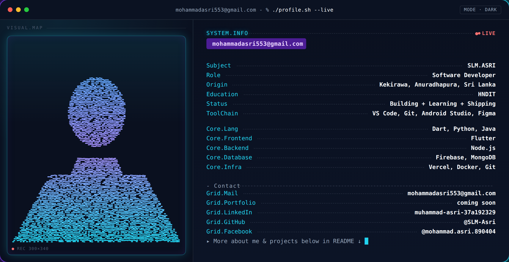

<h1 align="center">Hi 👋, I'm Muhammad Asri (SLM.ASRI)</h1>
<h3 align="center">Software Developer — Building + Learning + Shipping</h3>

  

  

---

### 🧭 About Me

- 📍 Based in **Kekirawa, Anuradhapura, Sri Lanka**
- 🎓 **HNDIT** graduate
- 💻 Currently building, learning, and shipping software
- ✉️ Reach me at **mohammadasri553@gmail.com**
- 🌐 Portfolio: *coming soon*

---

### 🛠️ Core Stack

| Category | Technologies |
|---|---|
| **Languages** | Dart, Python, Java |
| **Frontend** | Flutter |
| **Backend** | Node.js |
| **Database** | Firebase, MongoDB |
| **Infra / Tools** | Vercel, Docker, Git |

  

---

### 🧰 Toolchain

`VS Code` · `Git` · `Android Studio` · `Figma`

---

### 📫 Connect With Me

  
  
  
  

---

  
  

  

  

<i>▸ More about me &amp; projects below in README ↓</i>

